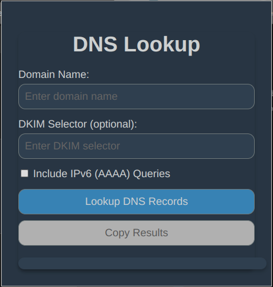
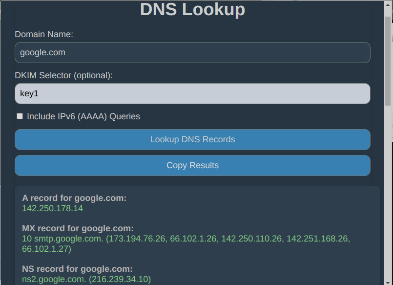
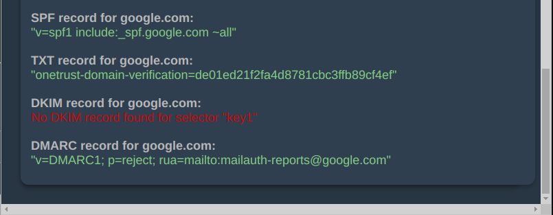

# Browser plugin for DNS Lookup

_Initial published version 0.93_

## Description

For a given domain and DKIM selector (optional) a output is generated of the results for the following DNS queries: A, AAA, MX, NS, DKIM, SPF, DMARC, CNAME. IPv6 queries are disabled by default. Also the output can be copied by a single click, you are welcome.

## The browser extension will consist of at least these files:

- manifest.json:  
The manifest file that describes your extension to the browser.

- popup.html: 
The HTML file for the extension's popup UI, where users input the domain and optional DKIM selector, enable/disable IPv6 queries and copy the generated output.

- popup.js: 
The JavaScript file linked from popup.html that handles user input, performs DNS lookups using Cloudflare's DNS over HTTPS API, and displays the results in the popup.

- popup.css:  
The CSS file linked from popup.html for styling

- images folder:  
The images folder contain 3 .png files (change them if you like) 16x16, 48x48 and 128x128 for the extension icons.

## How to load Extension into the Browser  
Chrome/Edge: Go to ***chrome://extensions/*** (or ***edge://extensions/*** for Edge), enable ***"Developer mode"***, and click ***"Load unpacked"***. Select the folder containing your extension's files.  
  
Firefox: Go to ***about:debugging***, click ***"This Firefox"***, and click ***"Load Temporary Add-on"***. Select the manifest file of your extension.

## Screen dumps

